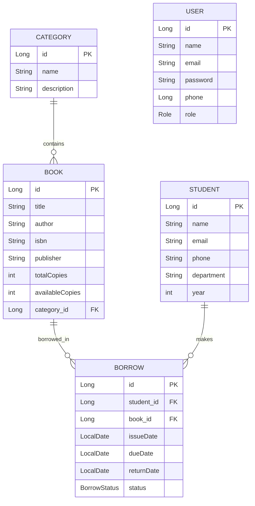

# Library Management System - Project Guide

## 1. Project Overview
The Library Management System is a comprehensive RESTful API built with Spring Boot. It allows a library to manage its catalog of books, student memberships, and borrowing operations. 

## 2. Technology Stack
- Java 21
- **Framework:** Spring Boot
- **Database:** PostgreSQL
- **ORM:** Spring Data JPA (Hibernate)
- **Utilities:** Lombok
- Springdoc OpenAPI (Swagger UI)

## 3. Entity-Relationship (ER) Diagram

## 4. Application Workflow

### Setup & Authentication Workflow
1. **User Registration:** Librarians/Admins can register via the `/api/auth/register` endpoint.
2. **User Login:** Users log in using `/api/auth/login` to get authenticated access (this project currently lays the groundwork for Role-based auth with `ADMIN`, `STUDENT`, `LIBRARIAN` roles).

### Catalog Management Workflow
1. **Category Creation:** The Librarian creates a `Category` (e.g., "Science Fiction", "Computer Science").
2. **Book Onboarding:** The Librarian adds new `Books` under specific categories, specifying details like ISBN, total copies, and available copies.

### Borrowing Workflow
1. **Student Registration:** Students are registered into the system so they can borrow books.
2. **Issuing a Book:** 
   - A student requests a book. 
   - The system checks if `availableCopies` > 0.
   - A `Borrow` record is created with `status = ISSUED`, `issueDate` as today, and a future `dueDate`.
   - The book's `availableCopies` is decremented.
3. **Returning a Book:**
   - The student returns the book.
   - The `Borrow` record `status` is updated to `RETURNED`, and `returnDate` is captured.
   - The book's `availableCopies` is incremented.

## 5. API Endpoints

### Authentication (`/api/auth`)
| Method | Endpoint | Description |
|--------|----------|-------------|
| `POST` | `/register` | Register a new user (Admin/Student/Librarian) |
| `POST` | `/login` | Authenticate and login |

### Books (`/api/books`)
| Method | Endpoint | Description |
|--------|----------|-------------|
| `POST` | `/` | Add a new book |
| `GET` | `/` | Get all books |
| `GET` | `/{id}` | Get book details by ID |
| `PUT` | `/{id}` | Update book details |
| `DELETE` | `/{id}` | Delete a book |
| `GET` | `/search/title` | Search books by title |
| `GET` | `/search/author` | Search books by author |

### Categories (`/api/categories`)
| Method | Endpoint | Description |
|--------|----------|-------------|
| `POST` | `/` | Create a new category |
| `GET` | `/` | Get all categories |
| `PUT` | `/{id}` | Update a category |
| `DELETE` | `/{id}` | Delete a category |

### Students (`/api/students`)
| Method | Endpoint | Description |
|--------|----------|-------------|
| `POST` | `/` | Register a new student |
| `GET` | `/` | Get all students |
| `GET` | `/{id}` | Get student by ID |
| `PUT` | `/{id}` | Update student details |
| `DELETE` | `/{id}` | Delete a student |

### Borrowing Operations (`/api/borrows`)
| Method | Endpoint | Description |
|--------|----------|-------------|
| `POST` | `/issue` | Issue a book to a student |
| `PUT` | `/return/{borrowId}`| Return an issued book |
| `GET` | `/history/{studentId}`| View a student's borrow history |
| `GET` | `/issued` | View all currently issued books |

## 6. Implementation Steps for Students

To recreate this project from scratch, students should follow these milestones:

1. **Project Initialization:**
   - Use Spring Initializr to bootstrap a Spring Boot app.
   - Add dependencies: Web, Data JPA, PostgreSQL Driver, Validation, Lombok.
   - Configure `application.properties` with database connection details and Hibernate auto-ddl settings (`update`).

2. **Entity Layer Implementation:**
   - Create `Category`, `Book`, `Student`, `Borrow`, and `User` entities.
   - Configure relationships: `@ManyToOne` for Book-Category, Borrow-Book, Borrow-Student.
   - Create Enums: `BorrowStatus` (ISSUED, RETURNED), `Role` (ADMIN, STUDENT, LIBRARIAN).

3. **Repository Layer:**
   - Create Spring Data JPA Repository interfaces for all entities (`JpaRepository`).
   - Add custom query methods if needed (e.g., `findByTitleContainingIgnoreCase` in `BookRepository`).

4. **DTOs (Data Transfer Objects):**
   - Create Request and Response DTOs to separate the API contract from database entities.

5. **Service Layer & Business Logic:**
   - Implement `BorrowService` with transactional logic: ensure book availability decreases on issue and increases on return.
   - Implement standard CRUD operations in other services.
   - Handle edge cases with a custom `ResourceNotFoundException`.

6. **Controller Layer:**
   - Create REST controllers mapped to the endpoints listed above.
   - Integrate with DTOs and Services.

7. **Global Exception Handling:**
   - Use `@RestControllerAdvice` to gracefully handle and return meaningful JSON error messages for exceptions like `ResourceNotFoundException`.

8. **Testing via Swagger UI:**
   - Add `springdoc-openapi-starter-webmvc-ui` dependency to enable Swagger.
   - Start the app and visit `http://localhost:8080/swagger-ui.html` to test the endpoints interactively.
